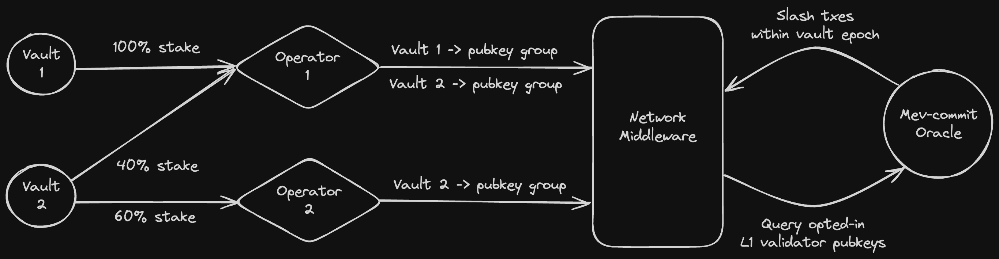

# Mev-commit Network Middleware Implementation

The `MevCommitMiddleware` contracts serve as an entrypoint for L1 validators to *opt-in* to mev-commit, and attest to the rules of our protocol, at the risk of funds being slashed. 

# Background

Before diving into protocol specifics, check out [Symbiotic docs](https://docs.symbiotic.fi/category/core-modules) and familiarize yourself with Vaults, Networks, and Operators.

# TLDR

*Figure 1: Integration Overview*

For L1 validators to be *opted-in to mev-commit*, some collateral stake must be slashable for each validator, in case that validator acts against its protocol commitments. In the context of Symbiotic, Vaults allocate slashable ERC20 collateral to Operators that are registered with the mev-commit network. This collateral may be slashable by other networks, hence it is *restaked*.

Operators for the mev-commit network are responsible for bulk registering groups of L1 validator pubkeys to an associated vault. Every registered validator is represented by restaked collateral from a single Vault and Operator. Each Vault’s total collateral can be split up to secure/represent many validators in groups**.**

Our network middleware contract requires any Vault registering with the contract to have a delegator of the `NetworkRestakeDelegator` type. `FullRestakeDelegator` is disallowed due to its ability for vaults to reuse stake within the same network to multiple Operators. In other words, a single instance of `slashAmount` vault collateral can only be used to secure a single validator.

# Steps for validator opt-in via symbiotic

1. Network EOA opts-in to Vault which will secure the validator(s).
    1. Delegator and slasher requirements can be validated off-chain. 
2. Vault manager sets a non-zero stake limit for mev-commit Network. 
3. Operator opts-in to both Vault and Network.
4. Vault manager allocates stake to relevant Operator for mev-commit Network. 
5. Network middleware contract owner registers both Operator and Vault with the Network. 
6. Operator bulk register groups of validator pubkeys associated to a Vault. 

# Design Detail

### The role of Operators

The Symbiotic protocol defines *Operators* as the entities running infrastructure for decentralized networks. Since the mev-commit oracle slashes on a per-L1-proposer basis, we need to explicitly associate Operators to individual validator pubkeys that the oracle would use for slashing logic. 

Operators’ main purpose will be to bulk register groups of validator pubkeys (each associated to a vault) that will represent the Operator. Vault collateral allocated to that Operator, will be slashable in case relevant validators acts against their agreements.

Any operator registering a validator pubkey agrees to the following:

<aside>
💡 A validator’s mev-boost client should ONLY connect to mev-commit opted-in relays, to ensure proposed blocks deliver commitments made. The Titan Holesky relay is the only supporting relay at this time. This list will be updated as more relays support the network.
</aside>

If any validator pubkey acts against this agreement as determined by the mev-commit oracle, Vault collateral allocated to the Operator who registered said pubkey will be slashed.

### Operator Registration and Blacklisting

Each Operator entity must be registered by the `MevCommitMiddleware` contract owner, and may be deregistered by the contract owner as needed. On mainnet the contract owner will be a Primev multisig, this multisig may need to execute regular transactions which register Operator(s).

Without an implicit, on-chain way to verify the association between L1 validator pubkeys and Operators through Symbiotic, Operators are **trusted by the owner** to register only pubkeys for which they have control over.

Any validator pubkey can only be mapped to a single Operator. So if an Operator registers a pubkey for which they do not own/manage (think “greifing”), the contract owner account reserves the right to *blacklist* Operators. The contract owner also reserves the right to *blacklist* Operators who register non-active or sybiled L1 validator pubkeys.

An on-chain dispute mechanism could eventually replace permissioned blacklisting, but is not worth targeting for v1.

Blacklisting consists of the owner account marking a particular Operator as blacklisted, regardless of that Operator’s previous state within the contract. Once blacklisted, all validator pubkeys registered by the Operator are no longer considered *opted-in.* Further, the contract owner has the ability to delete validator records associated with blacklisted Operators, thus allowing non-malicious Operators to register previously greifed validator pubkeys.

### **What defines a validator being "opted-in"?**

A validator pubkey being opted-in following registration is defined by the following criteria:

1. The validator pubkey must be fully registered
    1. Validator record stored. 
    2. De-registration request must not exist.
2. The validator pubkey’s associated Vault must be registered. 
    1. Vault record stored. 
    2. De-registration request must not exist.
    3. Vault is entity to core vault factory contract. 
3. The validator pubkey’s associated Operator must be registered
    1. Operator record stored. 
    2. De-registration request must not exist.
    3. The associated Operator must not be blacklisted. 
    4. Operator is entity to core operator registry contract. 
4. The validator must be *slashable* as defined in the next section.

Directly following a successful validator registration, all of these criteria will be true as enforced by the function. However, anyone of these criteria becoming false will result in the validator no longer being *opted-in* from the mev-commit protocol's perspective. For example, if slashable funds are withdrawn from a Vault collateralizing a group of validators, some of those validators will no longer be *slashable* and thus no longer *opted-in* (particularly the validators with the highest insertion index).

### What defines a validator being slashable?

When an Operator registers validator pubkeys in a group, insertion order is preserved within the group (recall a single valSet corresponds to a single Vault/Operator). The index of the pubkey acts as a priority rating representing which validators should be collateralized by the Vault over others.

The middleware contract must set a `slashAmount` for each ERC20/Vault. This much stake is required to define a single validator as being *slashable*. It must be large enough to disincentivize validators from acting maliciously against mev-commit. For a Vault ↔ valSet pair, `slashAmount * numVals` worth of collateral must be allocated to the registering Operator, to define all validators in the set as *slashable*. 

If less than `slashAmount * numVals` is allocated (restaked) to an Operator, only the first `allocatedStake / slashAmount` number of validators will be considered *slashable,* as determined by the index of each stored validator record. Once additional Vault collateral is deposited and/or allocated to the Operator, relevant registered validators become *slashable* again. Operators are able to deregister pubkeys, or re-register pubkeys to be represented by a new Vault, if slashable collateral becomes too low in an existing Vault.

### Slash mechanics

The mev-commit oracle has a permissioned account which is exclusively given rights to slash certain validator pubkeys which act maliciously or incorrectly against mev-commit. On-chain, the mapped validator record is retrieved, and the associated Vault/Operator securing said pubkey will be slashed `slashAmount` as configured by the middleware contract owner.

Oracle slashing must be invoked within `slashPeriodSeconds` of any event causing a validator to transition from *opted-in* to **not** *opted-in* (queryable by actors within the mev-commit pipeline)*.* The oracle attaches an `infractionTimestamp` to each validator pubkey when slashed. This timestamp corresponds to the `block.timestamp` of the block that was incorrectly proposed by the validator. 

`slashPeriodSeconds` is configured by the middleware contract and used as the minimum amount of seconds that must elapse before validator records, operator records, or vault records can be deleted from the middleware contract’s state. Further, Vault’s registered with our middleware contract must have a `epochDuration` greater than than `slashPeriodSeconds` to ensure collateral is slashable during the full slashing period. Read more about Symbiotic slashing guarantees [here](https://docs.symbiotic.fi/core-modules/vaults#slashing). 

Since a permissioned oracle account invokes slashing, the mev-commit middleware contract only requires the most basic slashing interface. Hence for Vaults that use a `VetoSlasher`, the resolver is required to be disabled via `address(0)`.

Upon the oracle submitting a slash transaction, the middleware contract emits a `ValidatorSlashed` event. This event contains an enum for slasher type that was used. If the slasher type is `VETO_SLASHER_TYPE`, the oracle is responsible for calling `IVetoSlasher.executeSlash` during the execute phase. Read more about Symbiotic veto slashing [here](https://docs.symbiotic.fi/core-modules/vaults#veto-slashing).

### Configuration of slashPeriodSeconds

`slashPeriodSeconds` must be configured such that mev-commit actors can query the proposer set for the current L1 epoch, query each proposer's opt-in status from the latest finalized L1 block (two L1 epochs ago), act upon said opt-in status during the current epoch, and allow a buffer for the oracle to possibly slash opted-in validators who act incorrectly.

Concretely, for validators to be slashable by the oracle, `slashPeriodSeconds` must be greater than:

`l1FinalizationPeriod` + `l1EpochPeriod` + `oracleProcessingPeriod`

or 

`3 * l1EpochPeriod` + `oracleProcessingPeriod`.

### Rewards

Operators and vault depositors will receive points commensurate with associated validator pubkey(s) being *opted-in* over time. When a Vault is represented by multiple validators, attribution is split evenly between the validators.

Validator opt-in state can be queried as described above. This query offers concrete criteria that must be true for Vault depositors and Operators to accrue points/rewards over time from an associated validator.

Points/rewards for LST restakers would be computed off-chain, with heavy use of indexed events. The exact point weightings associated to different actors/events is yet to be finalized.
