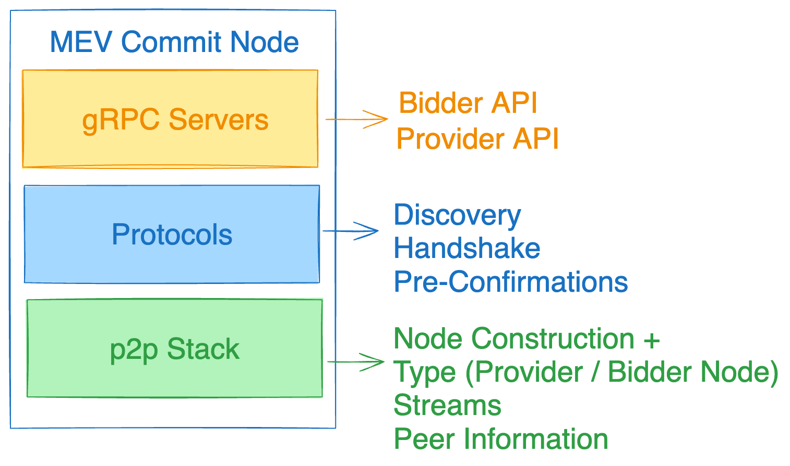

# mev-commit
mev-commit is P2P software that creates a network of execution providers and bidders. Bidders can broadcast bids to providers and receive commitments from them. A high throughput POA EVM chain settles the bids at the end of a block slot.

# mev-commit software components
  - [mev-commit client](https://github.com/primev/mev-commit/tree/main/p2p)
  - [mev-commit-geth](https://github.com/primev/mev-commit/tree/main/external/geth)
  - [contracts](https://github.com/primev/mev-commit/tree/main/contracts)
  - [mev-commit-oracle](https://github.com/primev/mev-commit/tree/main/oracle)
  - [mev-commit-bridge](https://github.com/primev/mev-commit/tree/main/external/geth/tree/master/geth-poa)
  - curl

# mev-commit execution requirements
- Software: mev-commit client and curl
- OS: 64-bit Linux, Mac OS X 10.14+
- CPU: 4+ cores @ 2.8+ GHz
- Memory: 16GB+ RAM
- Network: 1 GBit/sec broadband



## Single Line Script For Quick Experimentation
The command: 
- Installs Foundry: For smart contract development and testing.
- Downloads MEV-Commit Binary: The software included in this Repo, pre-built for your platform.
- Automatic Funding and Initialization: Prepares node for participation in mev-commit network.
- Runs the node with requisite configurations to connect to our running testnet.

### Bidder Node
```bash
curl -o launchmevcommit https://raw.githubusercontent.com/primev/scripts/main/launchmevcommit && chmod +x launchmevcommit && ./launchmevcommit --node-type bidder
```

### Provider Node
```bash
curl -o launchmevcommit https://raw.githubusercontent.com/primev/scripts/main/launchmevcommit && chmod +x launchmevcommit && ./launchmevcommit --node-type provider
```

## Quick Build (For docker please skip this instruction)

* Install [buf](https://buf.build/docs/installation)
```
buf generate
go build -o mev-commit ./cmd/main.go
```

When prompted, read the values of where the Smart-contracts where deployed on the settlement layer and update the configurations in the integrationtest/config/...yml files.

## Quickstart
- An ECDSA private key is required to create an ethereum address for the node as well as to use for the P2P network. Bidders can add an existing key or create a new key using the `create-key` command.
```
NAME:
   mev-commit create-key - Create a new ECDSA private key and save it to a file

USAGE:
   mev-commit create-key [command options] <output_file>

OPTIONS:
   --help, -h  show help
```

- Once the key is available, create a yaml config file. Example config files are available in the [config](https://github.com/primev/mev-commit/tree/main/p2p/config) folder. The important options are defined below:
```yaml
# Path to private key file.
priv_key_file: ~/.mev-commit/keys/nodekey

# Type of peer. Options are provider and bidder.
peer_type: provider

# Port used for P2P traffic. If not configured, 13522 is the default.
p2p_port: 13522

# Port used for HTTP traffic. If not configured, 13523 is the default.
http_port: 13523

# Port used for RPC traffic. If not configured, 13524 is the default.
rpc_port: 13524

# Secret for the node. This is used to authorize the nodes. The value doesnt matter as long as it is sufficiently unique. It is signed using the private key.
secret: hello

# Address of bidder registery
bidder_registry_contract: 0x62197Abd7672925c7606Bdf9931e42baCa6619AD

# Address of provider registery
provider_registry_contract: 0xeA73E67c2E34C4E02A2f3c5D416F59B76e7617fC

# Format used for the logs. Options are "text" or "json".
log_fmt: text

# Log level. Options are "debug", "info", "warn" or "error".
log_level: debug

# Bootnodes used for bootstrapping the network.
bootnodes:
  - /ip4/35.91.118.20/tcp/13522/p2p/16Uiu2HAmAG5z3E8p7o19tEcLdGvYrJYdD1NabRDc6jmizDva5BL3

# The default is set to false for development reasons. Change it to true if you wish to accept bids on your provider instance
expose_provider_api: false
```

- Once the config file is ready, run `mev-commit start` with the config option.
```
NAME:
   mev-commit start - Start the mev-commit node

USAGE:
   mev-commit start [command options] [arguments...]

OPTIONS:
   --config value  path to config file [$MEV_COMMIT_CONFIG]
   --help, -h      show help
```

- After the node is started, check the status of the peers connected to the node using the `/topology` endpoint on the HTTP port (optional).
```json
{
   "self": {
      "Addresses": [
         "/ip4/127.0.0.1/tcp/13526",
         "/ip4/192.168.1.103/tcp/13526",
         "/ip4/192.168.100.5/tcp/18625"
      ],
      "Ethereum Address": "0x55B3B672DEB14178615F648911e76b7FE1B23e5D",
      "Peer Type": "provider",
      "Underlay": "16Uiu2HAmBykfyf9A5DnRguHNS1mvSaprzYEkjRf6uafLU4javG4L"
   },
   "connected_peers": {
      "providers": [
         "0xca61596ccef983eb7cae42340ec553dd89881403"
      ]
   }
}
```

## Building Docker Image

To simplify the deployment process, you may utilize Docker to create an isolated environment to run mev-commit.

- Build the Docker Image:
  Navigate to the project root directory (where your Dockerfile is located) and run:
  
  ```
  docker build -t mev-commit:latest .
  ```
- Running with Docker Compose:

   If you want to just spin up the mev-commit p2p nodes, you may use:
  ```
  docker-compose up --build
  ```

- Stopping the Service:

  ```
  docker-compose down
  ```

## APIs for Bidders & Execution Providers
[Link to Documentation on Bidder and Execution provider API](./pkg/rpc/README.md)
- This includes: 
   - the payload for the Bidder API
   - The required setup for execution providers to process bids into commitments in their personal infra.


## Settlement Layer

This repository contains a settlement layer under the settlement/geth-poa folder. You can run the entire stack for multiple POA nodes locally from this folder.
See [here](./settlement/geth-poa/README.md#local-run) for instructions on running the Settlment Layer locally.
