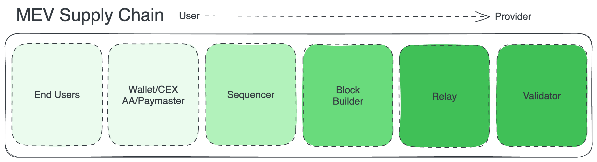
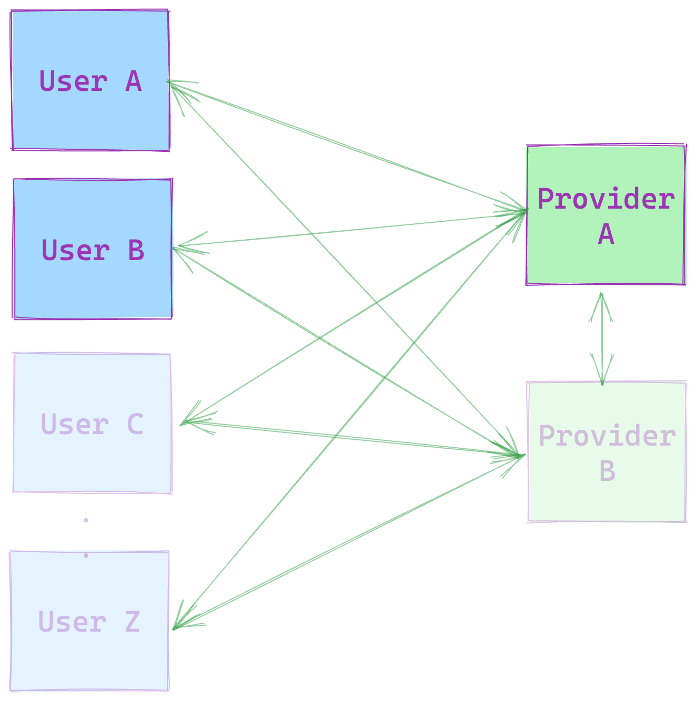
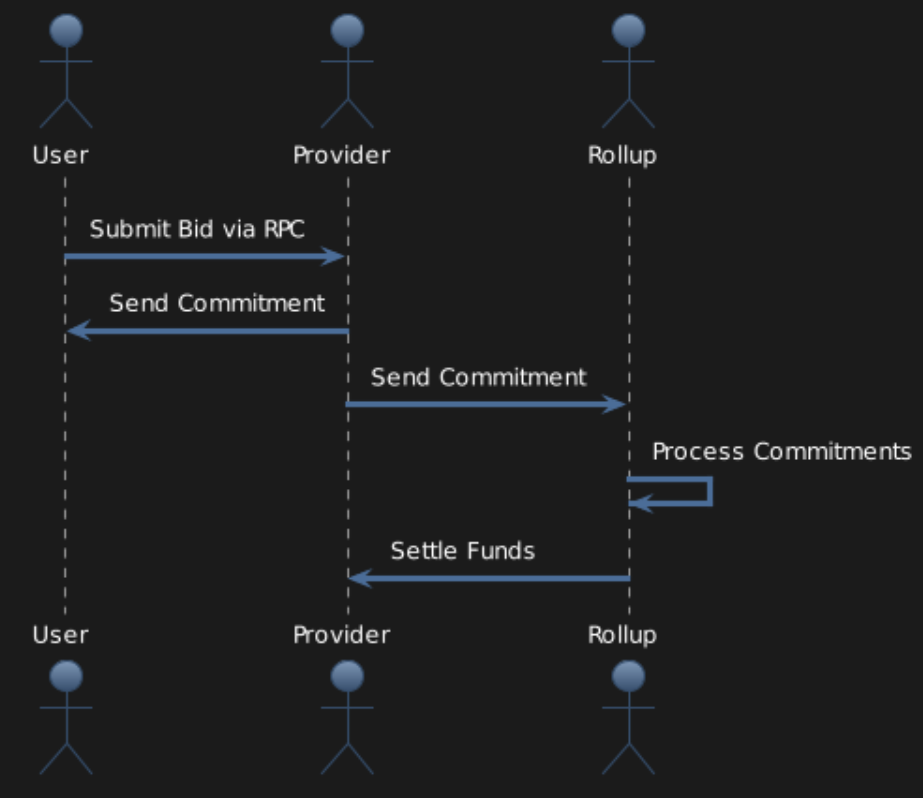

# mev-commit

## Summary
Introducing mev-commit, a peer-to-peer (P2P) networking software that serves as a conduit for real-time communication with execution providers. mev-commit enables MEV actors to join and utilize a P2P network for the exchange of execution bids and commitments, enriching the transaction execution experience by allowing for granular specification of execution needs and receiving real-time commitments.

## Actors
The roles of actors within this p2p ecosystem are defined with respect to other actors. A list of possible actors is given below. A good way to interpret them is to observe a given actors' relative placement in the diagram shown below. For example, an MEV Searcher (Transaction Originator) is a bidder to a Sequencer, and however, that same sequencer can be a bidder to a block builder. Thus, it's best to think of the roles of actors from the perspective of the MEV Supply Chain. To the left of the diagram are bidders who source MEV; and to the right of the diagram, are asset holders that help bidders actualize their MEV. These asset holders are providers in the p2p ecosystem. 

Traditionally, information only moved to the right in this supply chain, from bidders to providers. With our P2P network, we're allowing information about how the MEV is actualized to flow from providers back to bidders, along with cryptographic commitments that strengthen the value of information exchange.

**Providers**

Providers of execution services (**Block builders, Rollup Sequencers)**

**Bidders**

Bidders of execution services (**MEV searchers, AA bundlers, L2s, and other blockspace consumers)**

## Network Topology

The network topology we will be releasing is as follows:

Bidders will connect to providers, each of these nodes will have access to a bootnode for network startup. Providers will also be able to run gateway nodes to allow bidders to send bids directly to an RPC endpoint under a provider URL.

## Bids and Privacy

mev-commit is inherently pseudonymous, allowing any Ethereum address to submit a bid for transaction execution, including bids for transactions that belong to others. Bids use the transaction hash identifier for universal provider pickup and are visible to network actors. Bids are processed by both network providers and mev-commit chain nodes, ensuring verifiable commitments and seamless reward settlements.

## Commitments and Privacy

Commitments are commitment signatures from providers in response to bids. mev-commit provides a standard commitment method and a private commitment method for providers to choose from. Private commitments are encrypted and can only be read by the bidder until after the block slot ends and they’re revealed. Providers can also maintain their pseudonymity with commitments, using alternate addresses to obfuscate their identity as known block provider or sequencers.

## mev-commit chain

Bids and commitments will settle on a specialized EVM sidechain ran with go-ethereum’s Clique proof-of-authoriy (POA) consensus mechanism. Initially operated by Primev entities, the mev-commit chain handles fund settlements, rewards, and slashing. Over time we plan to authorize entities from around the MEV ecosystem to join the POA block signer set. The end goal is to enable a federated mev-commit chain where various actors from the system are assuming the block producer role in turns. Note the mev-commit chain is entirely separate from the Ethereum mainnet blockspace, and is optimized for significantly higher throughput.

For more information, see [mev-commit chain details](mev-commit-chain.md).

## Network Flows

Diagram depicting **the flow of bids, commitments, and funds**

