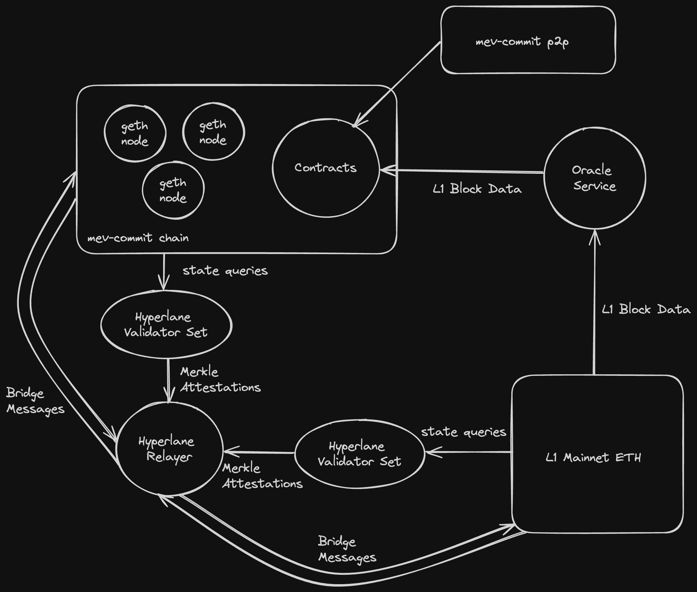

# mev-commit chain

## Overview

Primev will maintain a testnet consisting of the mev-commit chain, oracle service, and hyperlane bridge to Sepolia. 



## mev-commit chain connection details

### Bootnode endpoint

[http://34.215.163.180:8545](http://34.215.163.180:8545)

### Bridge frontend

[http://34.215.163.180](http://34.215.163.180)

### Block explorer

[http://34.209.10.199/blocks](http://34.209.10.199/blocks)

### Contract addresses

UserRegistry deployed to: 0x5FbDB2315678afecb367f032d93F642f64180aa3
ProviderRegistry deployed to: 0xe7f1725E7734CE288F8367e1Bb143E90bb3F0512
PreConfCommitmentStore deployed to: 0x9fE46736679d2D9a65F0992F2272dE9f3c7fa6e0
Oracle deployed to: 0x5FC8d32690cc91D4c39d9d3abcBD16989F875707
Whitelist deployed to: 0xc5bB85F941fb8dbbed6416A8aC84A06226E0f138

### Bridged ether

Native ether on the mev-commit chain maintains a 1:1 peg with ether on L1. That is, the only way to mint ether on the mev-commit chain is to lock equivalent ether in the hyperlane bridge contract on L1. In the other direction, ether can be burned on the mev-commit chain to unlock equivalent ether from the L1 contract.

Ether that is used as gas on the mev-commit chain will accumulate in a Primev owned treasury account on L1.

There are inherent security assumptions in obtaining ether on the mev-commit chain, involving:
* Hyperlane validators that attest to merkle inclusion of state.
* POA signers that maintain mev-commit chain state.
* The hyperlane bridging protocol and integration into the mev-commit chain.

The Primev core team is committed to secure and live bridging, all system components can be permissionlessly validated by anyone.

### Joining the mev-commit chain testnet

To join the mev-commit chain testnet with your own full-node, use Primev's [geth fork](https://github.com/primevprotocol/go-ethereum). We've modified geth to achieve shorter block periods than mainnet Ethereum, and to enable seamless native token bridging capabilities. Geth configuration will vary based on environment, but an example is provided below:

```bash
exec geth \
    --verbosity="$VERBOSITY" \
    --datadir="$GETH_DATA_DIR" \
    --port 30311 \
    --syncmode=full \
    --gcmode=full \
    --http \
    --http.corsdomain="*" \
    --http.vhosts="*" \
    --http.addr=0.0.0.0 \
    --http.port="$RPC_PORT" \
    --http.api=web3,debug,eth,txpool,net,engine \
    --bootnodes enode://34a2a388ad31ca37f127bb9ffe93758ee711c5c2277dff6aff2e359bcf2c9509ea55034196788dbd59ed70861f523c1c03d54f1eabb2b4a5c1c129d966fe1e65@172.13.0.100:30301 \
    --networkid=$CHAIN_ID \
    --unlock=$BLOCK_SIGNER_ADDRESS \
    --password="$GETH_DATA_DIR"/password \
    --mine \
    --miner.etherbase=$BLOCK_SIGNER_ADDRESS \
    --allow-insecure-unlock \
    --nousb \
    --netrestrict 172.13.0.0/24 \
    --metrics \
    --metrics.addr=0.0.0.0 \
    --metrics.port=6060 \
    --ws \
    --ws.addr=0.0.0.0 \
    --ws.port="$WS_PORT" \
    --ws.origins="*" \
    --ws.api=debug,eth,txpool,net,engine \
    --rpc.allow-unprotected-txs \
    --authrpc.addr="0.0.0.0" \
    --authrpc.port="8551" \
    --authrpc.vhosts="*" \
    --nat extip:$NODE_IP
```

Note this configuration will be productionized further in the coming weeks.

## Current design

The mev-commit chain is currently built out as an ethereum sidechain ran with [go-ethereum’s Clique proof-of-authoriy consensus mechanism](https://geth.ethereum.org/docs/tools/clef/clique-signing). 

### Level of decentralization

Today, most or arguably all Ethereum scaling solutions rely on centralized bridging and sequencing. Our system components rely on existing tech, and consequently inherit some centralization. However, we’ve chosen solutions that allow anyone to permissionlessly validate correct execution, and operation of chain infrastructure. 

To start, Primev entities will run all validating infrastructure for the mev-commit chain, where correct/honest operation can be permissionlessly audited. Spinning up a full node and connecting to the mev-commit chain as a peer is encouraged. It’s also encouraged for anyone to run their own bridge relayers. Over time we can permit entities outside of Primev to become POA signers or bridge validators.  

The mev-commit chain will continue to evolve. Open source scaling solutions that prove to become practical, decentralized, and/or provably secure will be utilized.

### POA geth nodes

Primev currently maintains one bootnode who doesn’t participate in consensus, and a set of fullnode POA signers. These signers take turns proposing the next block via a waiting period.

In order for mev-commit’s reward mechanism to be granular enough, the mev-commit chain must be able to commit blocks at a much faster rate than L1 Ethereum. We’ve chosen a target block period of 200ms. Thus on average 72 blocks will be committed on the mev-commit chain for every Ethereum mainnet block. 

Future experimentation will help identify the maximize the number of signers that can feasibly achieve our 200ms block period constraint. Additionally, we'll be investigating the impact of geographical distance between signers on network latency.

### Contracts

Contracts are deployed on the mev-commit chain to follow the state of bids and commitments, and invoke rewards or slashing as needed. Contracts are designed as follows:

* A pre-confirmation contract allows pre-confirmation commitments to bids from the p2p network to be tracked on-chain.
* Two separate registry contracts exist to manage users and providers, where both parties must stake ETH to participate. Rewards and/or slashing are managed by these contracts. 
* An oracle contract receives L1 payloads from the oracle service, to start it will receive data from L1 Testnet Sepolia, and transition to mainnet as we go from Testnet to Mainnet.
* A whitelist contract allows certain other contracts to mint/burn native ether as a part of bridging with L1.

### Oracle service

The oracle service is an off-chain process which interacts with the oracle contract as needed. This service monitors and extracts the winning builder and corresponding transaction hash list from each L1 block, and submits this data to the oracle contract residing on the mev-commit chain.

Although this oracle is currently centralized and operated by Primev, it can eventually be integrated into the mev-commit chain validation protocol, and secured by the same federated actors that operate the mev-commit chain.

### Bridge to Sepolia

The mev-commit chain is bridged to Sepolia via a [hyperlane warp route](https://docs.hyperlane.xyz/docs/protocol/warp-routes), involving multiple agents delivering or validating cross chain messages.

Users initiate a bridge transaction on L1 by locking ether in the bridge contract. A permissioned validator set monitors for these transactions and attests to their merkle inclusion on L1. A permissionless relayer agent then delivers the message to the mev-commit chain’s `Interchain Security Module` (ISM), which verifies validator signatures and mints native ether on the mev-commit chain as needed.

Bridging ether from the mev-commit chain back to L1 follows a similar process, except that native ether is burned on the mev-commit chain, and unlocked on L1.

Hyperlane exposes a contract interface which allows bridge users to pay ether to cover the costs of delivering a message on the destination chain. See [Interchain Gas Payment](https://docs.hyperlane.xyz/docs/protocol/interchain-gas-payment) for more details.

Running a hyperlane relayer is permissionless, and we encourage anyone to run their own relayer relevant to the mev-commit chain bridge. See [Running Relayers](https://docs.hyperlane.xyz/docs/operate/relayer/run-relayer) for more details.
