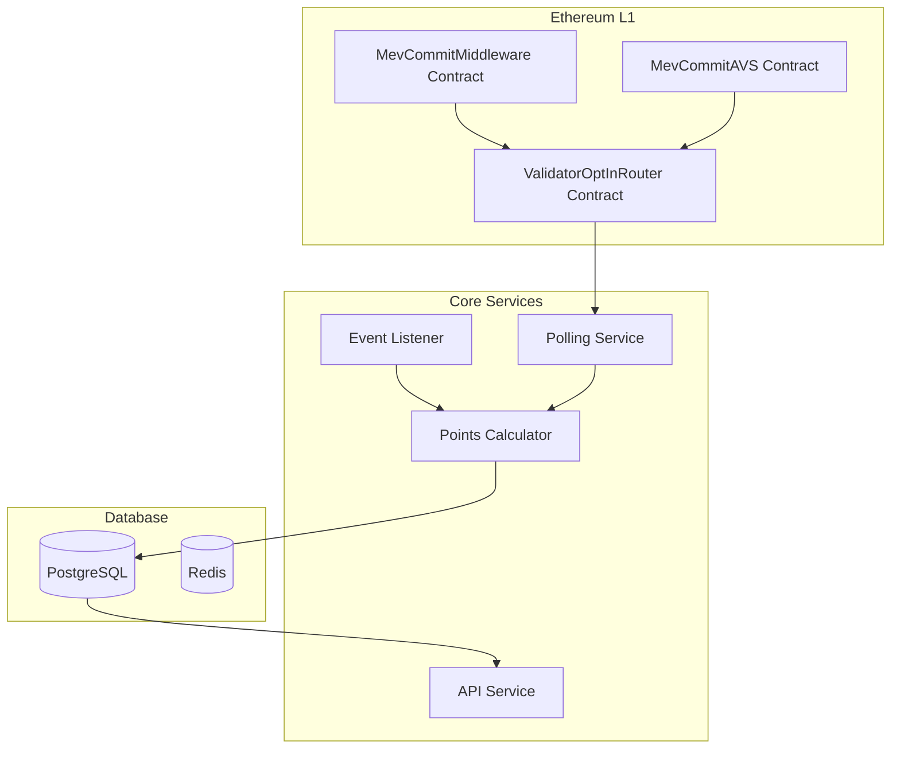

# MEV-Commit Points System Design Document

## Executive Summary 
The MEV-Commit Points System rewards validators for participating in the network. Validators earn more points the longer they stay active.


## Scale Context
The system needs to handle between 100,000 to 1 million validator public keys. At this scale, we need a robust way to track validator status changes, especially since validators can opt back in without generating detectable events. We'll begin with a polling-based approach while working toward an event-driven system.

## System Architecture



## Data Model

```sql
-- Configure reward tiers
CREATE TABLE multiplier_tiers (
    tier_id SERIAL PRIMARY KEY,
    min_days INTEGER NOT NULL,
    max_days INTEGER,
    multiplier DECIMAL(5,2) NOT NULL,
    created_at TIMESTAMP NOT NULL DEFAULT CURRENT_TIMESTAMP
);

-- Track operators
CREATE TABLE operators (
    address VARCHAR(42) PRIMARY KEY,
    registration_date TIMESTAMP NOT NULL,
    last_active_date TIMESTAMP NOT NULL,
    total_points DECIMAL(36,18) DEFAULT 0,
    is_active BOOLEAN DEFAULT true
);

-- Record validator participation periods
CREATE TABLE historic_timeseries (
    operator_address VARCHAR(42) NOT NULL,
    pubkey VARCHAR(98) NOT NULL,
    opted_in_time TIMESTAMP NOT NULL,
    opted_out_time TIMESTAMP,
    points_earned DECIMAL(36,18) DEFAULT 0,
    last_checked_at TIMESTAMP NOT NULL DEFAULT CURRENT_TIMESTAMP,
    PRIMARY KEY (operator_address, pubkey, opted_in_time)
) PARTITION BY RANGE (opted_in_time);
```

## Status Checking Process

The system maintains a complete history of validator participation. Even after a validator opts out, we continue to monitor their status because:
1. They might opt back in without generating an event we can detect
2. Different contracts (Middleware, AVS) have different event patterns
3. We need to maintain accurate historical records

Our polling service checks ALL known pubkeys in the system, not just currently active ones. This ensures we capture:
- Validators opting back in after being opted out
- Status changes across different contract types
- Complete participation history

We process validators in chunks of 32 pubkeys when calling the ValidatorOptInRouter contract. At our expected scale, this means:
- 100k validators = ~3,125 RPC calls per polling cycle
- 1M validators = ~31,250 RPC calls per polling cycle

## Core Processing Flow

1. Event Processing
   - Listen for new validator registrations
   - Record initial opt-ins
   - Store validator information

2. Status Polling
   - Query all known pubkeys from database
   - Check status in batches through ValidatorOptInRouter
   - Update database with any status changes

3. Points Calculation
   - Calculate points based on active duration
   - Apply appropriate multipliers
   - Record point distributions

## API Specification

Standard Symbiotic Endpoints:
1. `GET /health`
2. `GET /{receiver_type}/{receiver_address}`
3. `GET /stats`

Additional System Endpoints:
1. `GET /api/v1/status/{operator_address}`
2. `GET /api/v1/points/history/{operator_address}`
3. `GET /api/v1/tiers`

## Scale Considerations

Current Limitations:
1. Polling becomes resource-intensive at scale
2. RPC call volume grows linearly with validator count
3. Processing time increases with validator count

Future Improvements Needed:
1. Build specialized indexers for both contract types
2. Implement efficient event processing pipeline
3. Reduce reliance on polling where possible
4. Optimize database queries and partitioning

## Monitoring Requirements

Essential Metrics:
1. Total validators being monitored
2. Time to complete full polling cycle
3. RPC call success rate and latency
4. Status change frequency
5. Database performance metrics

## Future Development

As the system scales, we need to:
1. Move toward an event-driven architecture where possible
2. Implement more efficient status tracking mechanisms
3. Optimize database partitioning and cleanup
4. Improve monitoring and alerting systems

The goal is to maintain accurate points calculation while handling an increasing number of validators efficiently.