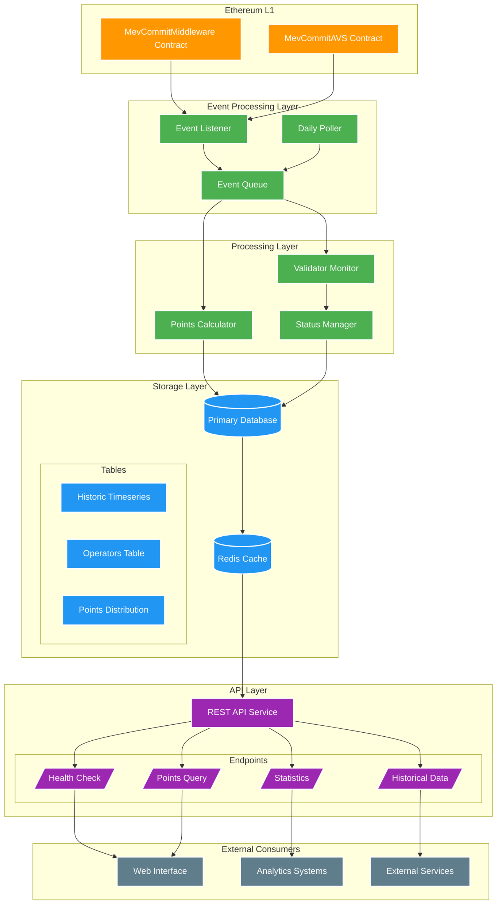

# MEV-Commit Points System Design Document

## Executive Summary 
The MEV-Commit Points System rewards validators for participating in the network. Validators earn more points the longer they stay active.

## Table of Contents
1. [System Architecture](#system-architecture)
2. [Data Model](#data-model)
3. [Points Calculation](#points-calculation)
4. [API Specification](#api-specification)
5. [Implementation Details](#implementation-details)
6. [Operational Considerations](#operational-considerations)

## System Architecture



## Data Model

### Core Tables

```sql
-- Configurable multiplier tiers
CREATE TABLE multiplier_tiers (
    tier_id SERIAL PRIMARY KEY,
    min_days INTEGER NOT NULL,
    max_days INTEGER,
    multiplier DECIMAL(5,2) NOT NULL,
    created_at TIMESTAMP NOT NULL DEFAULT CURRENT_TIMESTAMP,
    updated_at TIMESTAMP NOT NULL DEFAULT CURRENT_TIMESTAMP
);

-- Operators and their information
CREATE TABLE operators (
    address VARCHAR(42) PRIMARY KEY,
    registration_date TIMESTAMP NOT NULL,
    last_active_date TIMESTAMP NOT NULL,
    total_points DECIMAL(36,18) DEFAULT 0,
    is_active BOOLEAN DEFAULT true,
    created_at TIMESTAMP NOT NULL DEFAULT CURRENT_TIMESTAMP
);

-- Track validator opt-in periods
CREATE TABLE historic_timeseries (
    operator_address VARCHAR(42) NOT NULL,
    pubkey VARCHAR(98) NOT NULL,
    opted_in_time TIMESTAMP NOT NULL,
    opted_out_time TIMESTAMP,
    duration_days INTEGER GENERATED ALWAYS AS (
        CASE 
            WHEN opted_out_time IS NOT NULL 
            THEN EXTRACT(DAY FROM (opted_out_time - opted_in_time))::INTEGER
            ELSE EXTRACT(DAY FROM (CURRENT_TIMESTAMP - opted_in_time))::INTEGER
        END
    ) STORED,
    points_earned DECIMAL(36,18) DEFAULT 0,
    PRIMARY KEY (operator_address, pubkey, opted_in_time),
    FOREIGN KEY (operator_address) REFERENCES operators(address)
);

-- Points distribution records
CREATE TABLE points_distribution (
    distribution_id UUID PRIMARY KEY DEFAULT gen_random_uuid(),
    operator_address VARCHAR(42) NOT NULL,
    period_start TIMESTAMP NOT NULL,
    period_end TIMESTAMP NOT NULL,
    base_points DECIMAL(36,18) NOT NULL,
    multiplier DECIMAL(5,2) NOT NULL,
    total_points DECIMAL(36,18) NOT NULL,
    status VARCHAR(20) NOT NULL DEFAULT 'pending',
    created_at TIMESTAMP NOT NULL DEFAULT CURRENT_TIMESTAMP,
    FOREIGN KEY (operator_address) REFERENCES operators(address)
);
```

### Indexes and Performance Optimization

```sql
-- Efficient lookup of current validators
CREATE INDEX idx_current_status ON historic_timeseries (
    opted_out_time,
    operator_address,
    pubkey
) WHERE opted_out_time IS NULL;

-- Fast historical queries
CREATE INDEX idx_historic_timeseries_dates 
ON historic_timeseries (opted_in_time, opted_out_time);

-- Quick operator lookups
CREATE INDEX idx_historic_timeseries_operator 
ON historic_timeseries (operator_address);

-- Distribution period queries
CREATE INDEX idx_points_distribution_period 
ON points_distribution (period_start, period_end);
```

## Points Calculation

### Dynamic Multiplier Function

```sql
CREATE OR REPLACE FUNCTION calculate_points(
    p_duration_days INTEGER,
    p_base_rate DECIMAL
) RETURNS DECIMAL AS $$
DECLARE
    v_multiplier DECIMAL;
BEGIN
    SELECT multiplier INTO v_multiplier
    FROM multiplier_tiers
    WHERE min_days <= p_duration_days 
    AND (max_days IS NULL OR max_days >= p_duration_days)
    ORDER BY min_days DESC
    LIMIT 1;
    
    RETURN p_base_rate * COALESCE(v_multiplier, 1.0) * p_duration_days;
END;
$$ LANGUAGE plpgsql;
```

### Monthly Summary View

```sql
CREATE VIEW monthly_points_summary AS
SELECT 
    operator_address,
    DATE_TRUNC('month', opted_in_time) as month,
    COUNT(DISTINCT pubkey) as total_validators,
    AVG(duration_days) as avg_duration,
    SUM(points_earned) as total_points
FROM historic_timeseries
GROUP BY operator_address, DATE_TRUNC('month', opted_in_time);
```

## API Specification

The API follows Symbiotic's requirements while adding endpoints specific to our points system:

### Standard Endpoints
1. Health Check: `GET /health`
2. Points Query: `GET /{receiver_type}/{receiver_address}`
3. Statistics: `GET /stats`

### Points System Endpoints
1. Current Status: `GET /api/v1/status/{operator_address}`
2. Points History: `GET /api/v1/points/history/{operator_address}`
3. Tier Information: `GET /api/v1/tiers`

## Implementation Details

### Event Processing
The system processes events through several stages:

1. Event Capture
   - Monitor blockchain for validator registration/deregistration
   - Record opt-in and opt-out times
   - Queue events for processing

2. Daily Processing
   - Check current status of all validators
   - Update duration calculations
   - Apply appropriate multipliers

3. Points Distribution
   - Calculate points earned
   - Apply multipliers based on duration
   - Record distributions

## Operational Considerations

### Performance Optimization
Instead of using materialized views for frequently changing data, we implement:
- Efficient indexes for common queries
- Regular views for current status
- Caching for API responses
- Batch processing for daily updates

### Monitoring
Key metrics to track:
1. Event processing latency
2. Daily update completion time
3. API response times
4. Database query performance

### Data Retention
We maintain different retention policies:
1. Active Data: Full detail in main tables
2. Historical Data: Summarized monthly
3. Audit Logs: Retained for compliance

## Future Considerations

1. Additional Features
   - Custom reward periods
   - Special event multipliers
   - Achievement bonuses

2. Performance Enhancements
   - Horizontal scaling
   - Advanced caching strategies
   - Query optimization

3. Integration Options
   - Additional blockchain networks
   - External reward systems
   - Analytics platforms