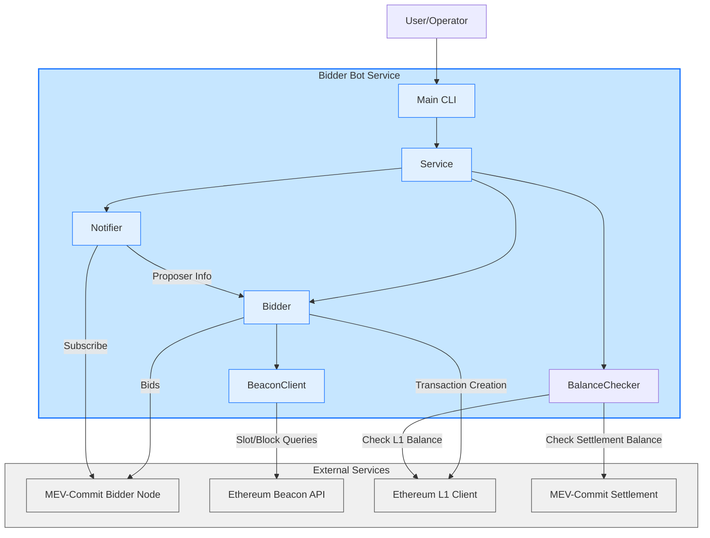
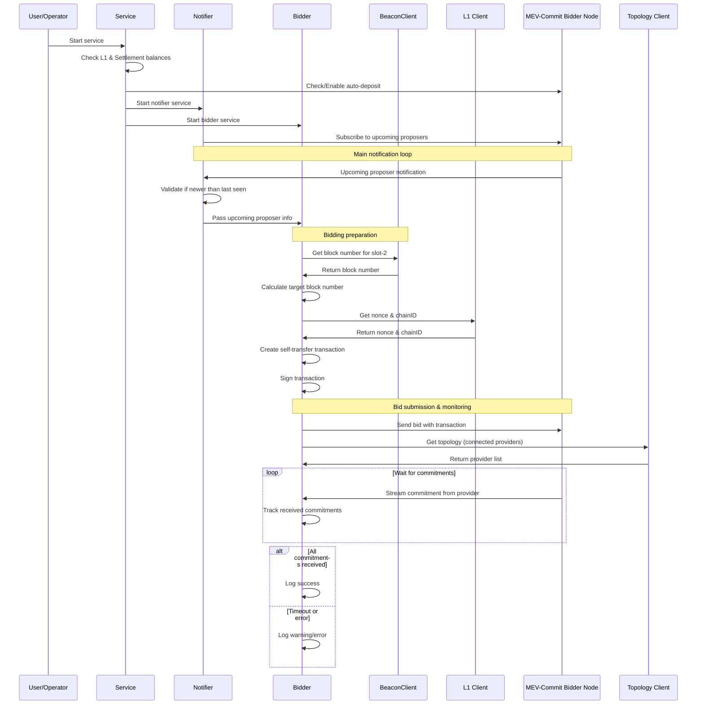
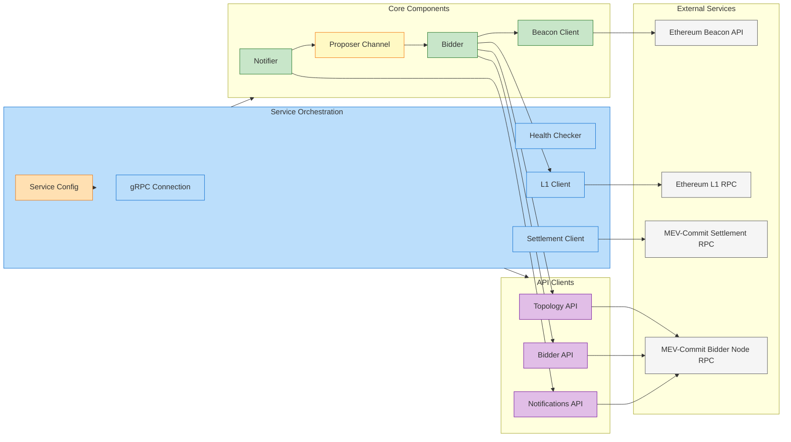
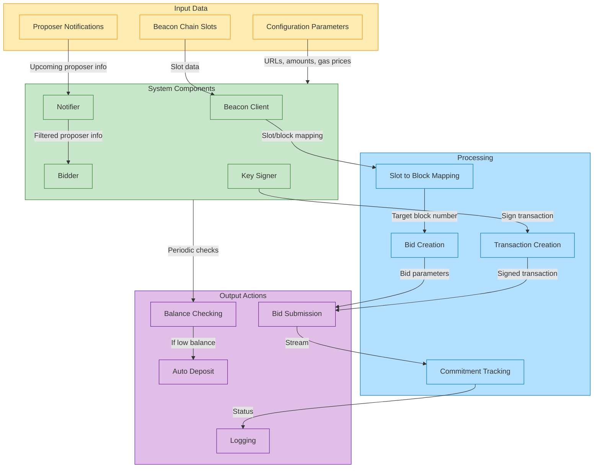
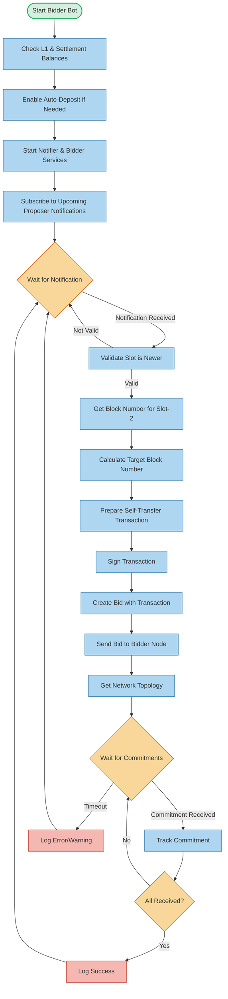

# MEV-Commit Bidder Bot

A Go service that automatically places bids for block space on the MEV-Commit network. This bot monitors for upcoming Ethereum block proposers, creates bids, and sends them to the MEV-Commit bidder node.

## Architecture Overview

The bidder bot consists of several key components that work together to monitor the Ethereum network and place bids at the appropriate time.



## Bidding Process Flow

The following diagram illustrates the complete flow of how the bidder bot monitors for upcoming block proposers and places bids.



## Component Details

The bidder bot is composed of several key components, each with distinct responsibilities.





### Key Components

1. **Service** - The main orchestrator that initializes and coordinates all other components
2. **Notifier** - Subscribes to and processes notifications about upcoming block proposers
3. **Bidder** - Handles the creation and submission of bids to the MEV-Commit network
4. **BeaconClient** - Interfaces with the Ethereum Beacon chain to retrieve slot and block information
5. **KeySigner** - Manages cryptographic signing of transactions using a keystore file

## Configuration

The bidder bot accepts the following configuration parameters:

```
--keystore-dir         Directory where keystore file is stored [required]
--keystore-password    Password to access keystore [required]
--l1-rpc-urls          URLs for L1 RPC endpoints [required]
--beacon-api-urls      URLs for Beacon API endpoints [required]
--settlement-rpc-url   URL for settlement RPC [required]
--bidder-node-rpc-url  URL for mev-commit bidder node RPC [required]
--auto-deposit-amount  Amount to auto-deposit (default: 0.1 ETH)
--bid-amount           Amount to use for each bid (default: 0.005 ETH)
--gas-tip-cap          Gas tip cap (default: 0.015 gwei)
--gas-fee-cap          Gas fee cap (default: 1 gwei)
--log-fmt              Log format: 'text' or 'json' (default: text)
--log-level            Log level: 'debug', 'info', 'warn', 'error' (default: info)
```

## Getting Started

### Prerequisites

- Go 1.20 or higher
- Ethereum keystore file with sufficient ETH on both L1 and MEV-Commit settlement layer
- Access to Ethereum L1 and Beacon chain endpoints
- Access to MEV-Commit bidder node and settlement layer endpoints

### Building

```bash
go build -o bidder-bot ./tools/bidder-bot
```

### Running

```bash
./bidder-bot \
  --keystore-dir=/path/to/keystore \
  --keystore-password=your_password \
  --l1-rpc-urls=https://ethereum-rpc.example.com \
  --beacon-api-urls=https://ethereum-beacon.example.com \
  --settlement-rpc-url=https://settlement-rpc.example.com \
  --bidder-node-rpc-url=https://bidder-node.example.com \
  --log-level=info
```

## How It Works



1. **Service Initialization**:
   - Check balances on L1 and settlement layer
   - Set up auto-deposit if needed
   - Initialize and start the Notifier and Bidder components

2. **Notification Subscription**:
   - The Notifier subscribes to upcoming proposer notifications from the MEV-Commit network
   - When a notification arrives, it's validated and passed to the Bidder

3. **Bid Preparation**:
   - The Bidder uses the BeaconClient to get the corresponding block number for the target slot
   - A self-transfer Ethereum transaction is created and signed with the configured keystore
   - This transaction is included in the bid to demonstrate user intent

4. **Bid Submission**:
   - The bid is submitted to the MEV-Commit Bidder Node with the transaction data
   - The Bidder tracks commitments from providers in response to the bid
   - Success or failures are logged appropriately