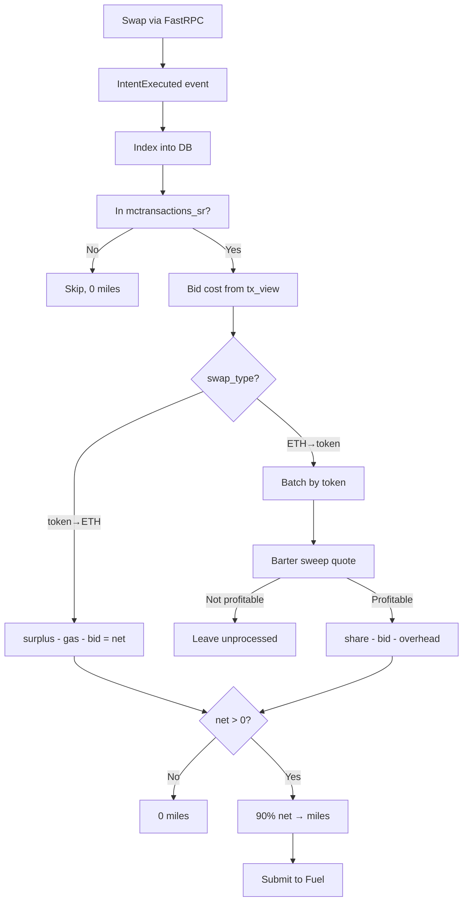

# fastswap-miles

Indexes `IntentExecuted` events from the FastSettlementV3 contract, calculates net profit per swap, and awards 90% of profit as miles to users via the Fuel API.

## Flow



### Main Loop

1. **Index** — Polls L1 in batches (`-batch`, default 2000 blocks), filters for `IntentExecuted` events from the FastSettlementV3 contract, and inserts into StarRocks (`fastswap_miles` table).
2. **Process** — Once caught up to chain tip, processes all unprocessed rows:
   - **Token→ETH swaps** (swap_type=`eth_weth`): surplus is already in ETH, calculate profit immediately.
   - **ETH→Token swaps** (swap_type=`erc20`): accumulated token surplus is batched and swept to ETH via FastSwap.
3. **Award** — 90% of net profit → miles, submitted to Fuel API. Row marked `processed = true`.

### Profit Calculation

**Token→ETH** (processed immediately):
```
net_profit = surplus - gas_cost - bid_cost
```
- `gas_cost` = `receipt.GasUsed × receipt.EffectiveGasPrice` (we pay gas for token-input swaps)
- `bid_cost` from most recent `OpenedCommitmentStored` event in `tx_view` (ordered by block number DESC)
- Gas cost is **zeroed** for ETH-input swaps (user pays gas)

**ETH→Token** (batched, swept when profitable):
```
sweep_return = Barter quote for all accumulated surplus of that token
per_user_return = sweep_return × (user_surplus / total_surplus)
net_profit = per_user_return - bid_cost - proportional_gas_overhead
```

### FastSwap Sweep (ERC20 → ETH)

When ERC20 surplus accumulates from ETH→Token swaps, the service periodically checks if sweeping those tokens to ETH is profitable. It does this by running a dry-run test swap against the Barter API:

1. **Batching**: Groups all unprocessed `erc20` swaps by their output token.
2. **Quote**: Gets a Barter swap quote (2% slippage) to sell the *total sum* of the accumulated token surplus for ETH.
3. **Profitability Check**: 
   - Calculates the net return in ETH (`quote.AmountOut`).
   - Slices the proportional Barter sweep execution gas cost per user.
   - If `user_sweep_return > bid_cost + gas_overhead`, the user is profitable. The sweep executes if the batch overall has a positive net profit.
4. **Execution**: If profitable, signs a Permit2 EIP-712 `PermitWitnessTransferFrom` with the Intent as witness, and POSTs to the `/fastswap` endpoint. `userAmtOut` is set to 95% of Barter's `minReturn` to allow for price movement between quote and execution.
5. **Distribution**: The point value of the swept ETH is divided proportionally among the users in the batch for accounting purposes. 90% of each user's calculated net profit is awarded to them as miles.

**Executor exclusion**: The executor/treasury address is filtered out (`WHERE user_address != executor`) so sweep transactions don't earn miles.

## Database

**StarRocks** — `mevcommit_57173.fastswap_miles`

| Column | Type | Description |
|---|---|---|
| `tx_hash` | VARCHAR(100) PK | L1 transaction hash |
| `block_number` | BIGINT | L1 block number |
| `block_timestamp` | DATETIME | Block timestamp |
| `user_address` | VARCHAR(64) | Swap initiator |
| `input_token` | VARCHAR(64) | Token sent by user |
| `output_token` | VARCHAR(64) | Token received by user |
| `surplus` | VARCHAR(100) | Executor surplus (raw wei) |
| `gas_cost` | VARCHAR(100) | L1 gas cost (wei) |
| `bid_cost` | VARCHAR(100) | mev-commit bid cost (wei) |
| `swap_type` | VARCHAR(16) | `eth_weth` or `erc20` |
| `surplus_eth` | DOUBLE | Surplus in ETH |
| `net_profit_eth` | DOUBLE | Net profit after costs |
| `miles` | BIGINT | Miles awarded |
| `processed` | BOOLEAN | `false` = not yet awarded |

## CLI Flags

### Production Mode

```bash
go run ./tools/fastswap-miles/ \
  -l1-rpc-url $L1_RPC_URL \
  -keystore /path/to/keystore.json \
  -passphrase $KEYSTORE_PASSWORD \
  -barter-url $BARTER_URL \
  -barter-api-key $BARTER_KEY \
  -fuel-api-url $FUEL_URL \
  -fuel-api-key $FUEL_KEY \
  -fastswap-url "https://fastrpc.mev-commit.xyz" \
  -funds-recipient "0x..." \
  -db-user $DB_USER \
  -db-pw $DB_PW \
  -db-host $DB_HOST \
  -start-block 21781670
```

### Dry-Run Mode

Indexes events and computes miles but **skips** Fuel submission and processed marking. Rows remain `processed = false` so the real service will pick them up.

```bash
go run ./tools/fastswap-miles/ \
  -dry-run \
  -l1-rpc-url $L1_RPC_URL \
  -barter-url $BARTER_URL \
  -barter-api-key $BARTER_KEY \
  -db-user $DB_USER \
  -db-pw $DB_PW \
  -db-host $DB_HOST \
  -start-block 21781670
```

### All Flags

| Flag | Default | Description |
|---|---|---|
| `-l1-rpc-url` | (required) | L1 Ethereum HTTP RPC URL |
| `-keystore` | | Path to executor keystore JSON file |
| `-passphrase` | | Keystore password |
| `-barter-url` | (required) | Barter API base URL |
| `-barter-api-key` | | Barter API key |
| `-fuel-api-url` | | Fuel points API URL (required in production) |
| `-fuel-api-key` | | Fuel points API key (required in production) |
| `-fastswap-url` | | FastSwap API endpoint (e.g., `https://fastrpc.mev-commit.xyz`) |
| `-funds-recipient` | `0xD588...` | Address to receive swept ETH |
| `-max-gas-gwei` | `50` | Skip sweep if L1 gas exceeds this |
| `-contract` | `0x084C...` | FastSettlementV3 proxy address |
| `-weth` | `0xC02a...` | WETH contract address |
| `-start-block` | `0` | Block to start indexing (0 = resume from DB) |
| `-poll` | `12s` | Poll interval for new blocks |
| `-batch` | `2000` | Blocks per `eth_getLogs` batch |
| `-dry-run` | `false` | Compute miles without submitting or marking |
| `-log-fmt` | `json` | Log format (`text` or `json`) |
| `-log-level` | `info` | Log level (`debug`, `info`, `warn`, `error`) |
| `-log-tags` | | Comma-separated `name:value` pairs for log lines |
| `-db-user` | | StarRocks user |
| `-db-pw` | | StarRocks password |
| `-db-host` | `127.0.0.1` | StarRocks host |
| `-db-port` | `9030` | StarRocks port |
| `-db-name` | `mevcommit_57173` | StarRocks database |

## File Structure

| File | Purpose |
|---|---|
| `main.go` | CLI, main loop, DB helpers, Barter/Fuel API clients, utility functions |
| `miles.go` | `serviceConfig`, `processMiles`, `processERC20Miles`, bid cost lookups |
| `sweep.go` | Event indexer, token sweep, Permit2 approval, EIP-712 signing |
| `main_test.go` | Unit tests for miles calculation, API clients, helpers |

## Key Behaviors

- **Auto-resume**: If `-start-block` is 0, resumes from last saved block in `fastswap_miles_meta`.
- **Permit2 auto-approval**: If the executor hasn't approved a token to Permit2, automatically sends a max-uint256 approval before sweeping. 15-minute receipt timeout.
- **FastRPC check**: Only transactions found in `mctransactions_sr` get miles (filters out non-FastRPC swaps).
- **Bid cost dedup**: When multiple providers commit to the same tx, uses the most recent `OpenedCommitmentStored` event (by block number).
- **Dry-run safety**: In dry-run mode, rows are never marked as processed and no Fuel submissions are made.
- **Caught-up guard**: Miles are only processed after the indexer has caught up to the chain tip, avoiding excessive Barter API calls during historical backfill.
- **Graceful shutdown**: Catches SIGINT/SIGTERM, finishes current batch, then exits.
- **Idempotent**: Re-running from the same start block is safe — inserts use `INSERT INTO` with primary key dedup.
- **Fuel-submission idempotency** (three-layer defense built in response to the 2026-04-16 double-credit incident, in which an operator re-used the contract deployment block as `-start-block` on a pod restart, causing the indexer to re-walk all history):
  1. `insertEvent` checks tx_hash existence before INSERT, skipping re-inserts. The `fastswap_miles` table uses StarRocks `PRIMARY KEY(tx_hash)` — an unconditional INSERT upserts the row and wipes columns (including `processed`, `miles`, `fuel_submitted_at`) not specified in the INSERT. Without this check, any block rescan — whether from an explicit `-start-block` flag, a manual reset, or any other trigger — destroys already-processed rows and causes mass re-submission to Fuel. This is the primary fix: re-walking history is now idempotent.
  2. Each row carries a `fuel_submitted_at` timestamp set only when `submitToFuel` succeeds. The service skips re-submission for any row where it is non-null, even if `processed` is flipped back to false by any means. Backstop against future reset paths.
  3. `saveLastBlock` issues a single atomic INSERT (fastswap_miles_meta has PRIMARY KEY(k) so INSERT upserts). The prior DELETE-then-INSERT pattern could vanish the `last_block` row if the pod died between the two statements. Hardening rather than incident root cause, but worth fixing.

### Schema requirement

Before deploying, ensure the DB has the `fuel_submitted_at` column. The service's SELECT queries require it:

```sql
ALTER TABLE mevcommit_57173.fastswap_miles
    ADD COLUMN fuel_submitted_at DATETIME NULL;

-- Backfill: mark every row that has already been submitted to Fuel so the
-- service's idempotency check will skip re-submission.
UPDATE mevcommit_57173.fastswap_miles
SET fuel_submitted_at = CURRENT_TIMESTAMP
WHERE miles > 0 AND fuel_submitted_at IS NULL;
```

The UPDATE is idempotent — safe to run multiple times (e.g. right before and after code deploy to catch rows processed in the gap window).
